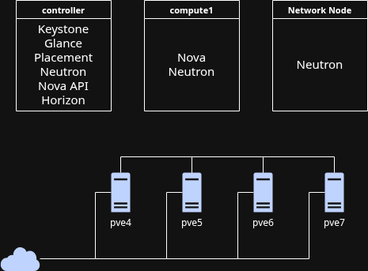

Projet-Cloud
============

Equipe : Infrastructure cluster 2 et OpenStack

Membre : XX et XX

# Schéma

# HowTo

1. [Installation du Cluster Proxmox + Ceph](install-proxmox.md)
2. [Mise en place du controller OpenStack](install-openstack-controller.md)
3. [Mise en place du compute OpenStack](install-openstack-compute.md)
4. [Mise en place du noeud réseau OpenStack](install-openstack-networknode.md)

# Axes d'amélioration

Cette mise en place d'OpenStack est loin d'être terminé, nous pourrons par exemple continuer sur des sujets :

- création de plusieurs noeuds compute
- stockage des disques sur un espace de stockage partagé (ceph des pve ou Cinder)
- mettre en place de service Ironic
- passer sur un réseau "option 2" pour gérer les IP flottantes

# RetEx

Ce projet nous a permis, dans un premier temps, de découvrir la mise en cluster avec Proxmox ainsi que les problèmes liés à Ceph sur un réseau instable.

Dans un second temps, nous avons découvert le monde OpenStack grâce à sa mise en place particulièrement complexe et ses messages d'erreurs très précis. 🙃
